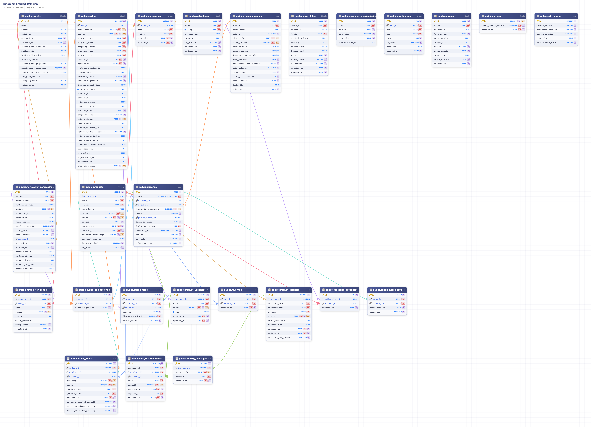

# Informe Técnico de Arquitectura y Selección de Herramientas
## Proyecto: "FashionStore" - E-commerce de Moda con Gestión de Inventario

---

### 1. Justificación del Stack Tecnológico

Como arquitectos de software responsables del diseño y desarrollo de "FashionStore", hemos seleccionado un stack tecnológico moderno, robusto y altamente escalable, priorizando los requerimientos del cliente: velocidad de carga, posicionamiento SEO, gestión de estado compleja y despliegue autogestionado en infraestructura propia (VPS).

#### 1.1 Frontend: Astro 5.0 (Modo Híbrido)
Se ha elegido **Astro 5.0** configurado en modo `hybrid` (híbrido) en lugar de alternativas como Next.js o un framework SPA puro (React/Vue). La elección se justifica por:
- **SSG para SEO y Rendimiento:** Las páginas del catálogo público (la *home*, el listado de productos y las fichas individuales) se generan de forma estática (SSG - Static Site Generation) en el momento del *build*. Esto garantiza tiempos de respuesta hiperrápidos, vitales tanto para la experiencia del usuario móvil como para el posicionamiento orgánico en Google (SEO), un requisito crítico para el cliente.
- **SSR Estricto para Zonas Privadas:** Las rutas como el panel de control (`/admin/*`) y el Checkout, que requieren validación en tiempo real y renderizado en servidor (Server-Side Rendering), se renderizan dinámicamente, garantizando seguridad y la lectura de datos actualizados al milisegundo.
- **Islands Architecture:** Para mantener el peso de JavaScript enviado al navegador al mínimo, hemos confinado la interactividad extrema (como el botón de "Añadir al Carrito" o el Slide-over del carrito) a "Islas" aisladas usando Preact/React, que se hidratan de forma independiente de la página estática.

#### 1.2 Gestión de Estado del Cliente: Nano Stores
Garantizamos la persistencia del carrito de la compra con **Nano Stores**. A diferencia del estado local clásico en React, `cartStore.ts` permite compartir datos reactivos entre distintas islas arquitectónicas (Astro y React) y mantener el estado serializado entre navegaciones por las páginas estáticas del sitio web, evitando la pérdida del carrito.

#### 1.3 Estilos: Tailwind CSS
Adoptamos **Tailwind CSS** para satisfacer íntegramente el requerimiento de diseño y UX "Premium" ("Minimalismo Sofisticado"). Nos permite definir de manera determinista un sistema de diseño con la paleta de colores de la marca (`brand-black`, `brand-gold`) y componentes altamente responsivos sin inflar la hoja de estilos global final.

#### 1.4 Backend as a Service (BaaS): Supabase
De acuerdo a las restricciones del proyecto y nuestras necesidades de un backend integral, aprovechamos la potencia de **Supabase**:
- **Base de Datos (PostgreSQL):** Nos ofrece integridad referencial estricta, tipos de datos robustos, y sobre todo, nos permite ejecutar transacciones atómicas seguras desde nivel de base de datos a través de Procedimientos Almacenados (RPC).
- **Autenticación (Auth):** Gestionamos el inicio de sesión y perfiles de los dueños de la tienda para el Backoffice, asegurando proteger las rutas del API a nivel de servidor.
- **Storage Buckets:** Hemos configurado un Bucket público con control de subida protegido para que el Panel de Admin hospede nativamente todo el contenido multimedia de alta resolución.
- **Seguridad Perimetral (RLS - Row Level Security):** Políticas de seguridad nivel de fila definen estricta separación de lectura pública (todo los usuarios) versus borrado y escritura (solo administradores autenticados).

---

### 2. Explicación del Esquema y Arquitectura de Datos

El diseño de la base de datos se ha concebido bajo reglas estrictas de normalización (tercera forma normal 3NF) para evitar redundancias de información y garantizar la consistencia relacional.

El diagrama Entidad-Relación (ER) (adjunto como imagen complementaria a este informe) describe detalladamente cómo interactúan las siguientes capas:

- **Catálogo (`products`, `categories`):** Estructuran jerárquicamente la tienda. Cada registro de producto incluye campos vitales como matriz de imágenes (JSON Array), el precio (almacenado como un número entero o numérico en céntimos, para certificar precisión matemática y evitar anomalías de coma flotante que podrían ocurrir utilizando *Floats*), y un control primitivo para ofertas/novedades.
- **Pedidos y Carrito (`orders`, `order_items`):** Actúan como un nodo conector de transacciones. A un `orders` se ligan los datos logísticos y un estado (`enum_order_status`: Pendiente, Pagado, Enviado, Mantenimiento, Entregado, etc.), mientras que `order_items` almacena la fotografía exacta en el tiempo de lo que se compró, registrando el ID del producto y el importe unitario que existía la tarde de la venta.

---

### 3. Solución de Lógica Compleja: Flujos de Atomicidad y Gestión de Devoluciones

#### 3.1 Transacciones de Stock (Atomicidad)
La venta de productos en un E-commerce presenta un peligro tecnológico conocido como "condición de carrera" (Race Condition): el riesgo de vender productos de los que **no** queda inventario general, causando enfados en la cadena logística y usuarios finales. 

Para erradicar esto, todo nuestro flujo de asignación y liberación de material interactúa a través de operaciones **Atómicas** transaccionales utilizando características nativas de PostgreSQL en Supabase.
- Cuando un pedido se confirma o, como un requisito exigido, el cliente cancela la orden **antes de que el artículo haya sido despachado**, nuestra API no calcula el stock y luego lo modifica. En su lugar, llama directamente a una rutina en base de datos (`Stored Procedure` o comandos asíncronos en bloque) que **retorna el importe matemático directamente al campo de stock de la tabla de producto**.
- Esto fuerza un candado de base de datos donde ninguna petición web simultánea pueda alterar esos mismos dígitos antes de tiempo.

#### 3.2 El Flujo Contable (Facturación y Abonos)
El ciclo del E-commerce termina y da inicio desde un plano financiero a través del módulo de *Invoices* (Facturación), uno de los apartados más completos de nuestra plataforma corporativa.

1. **La Factura de Venta:** Cuando un pedido pasa a un estado verificado (Pagado/Completado), el servidor compila los datos del cliente, los artículos comprados (`order_items`), y emite o sincroniza una factura inicial en la tabla correspondiente, estampulando sumatorias y tasas impositivas, conformando la figura legal de Venta Activa.
2. **El Rectificativo o "Factura de Abono":** Hemos resuelto un problema complejo contable que es la devolución del material. Cuando un administrador o el sistema automático aprueba el reintegro de una devolución gestionada post-entrega, el sistema, en lugar de borrar la factura anterior (acción ilícita contablemente), genera dinámicamente una **Factura de Abono (Rectificativa)** vinculada al pedido inicial.
3. El truco computacional reside en inyectar dentro de nuestro ecosistema un importe matemáticamente opuesto (multiplicaciones de los valores netos a `-1`). Los objetos visualizados reflejan un importe total en Euros **negativo**. Gracias a esto, todos los gráficos o descargas que crucen informes de ventas mensuales logran **cuadrar perfectamente la caja**, restándole los importes precisos al volumen de ventas positivo y cerrando el ciclo íntegro post-venta.

---

### 4. Entorno de Despliegue y Sistemas
La arquitectura se concibe para escapar del PaaS tradicional propietario. Ha sido certificada la viabilidad del despliegue integral bajo contenedor en una red VPS personal autogestionada mediante la orquestación de **Coolify**, aislando las variables de entorno de producción (`SUPABASE_URL`, claves de enrutamiento) en un cofre sellado de Docker para propósitos robustos de estabilidad profesional y bajos costes operativos.
